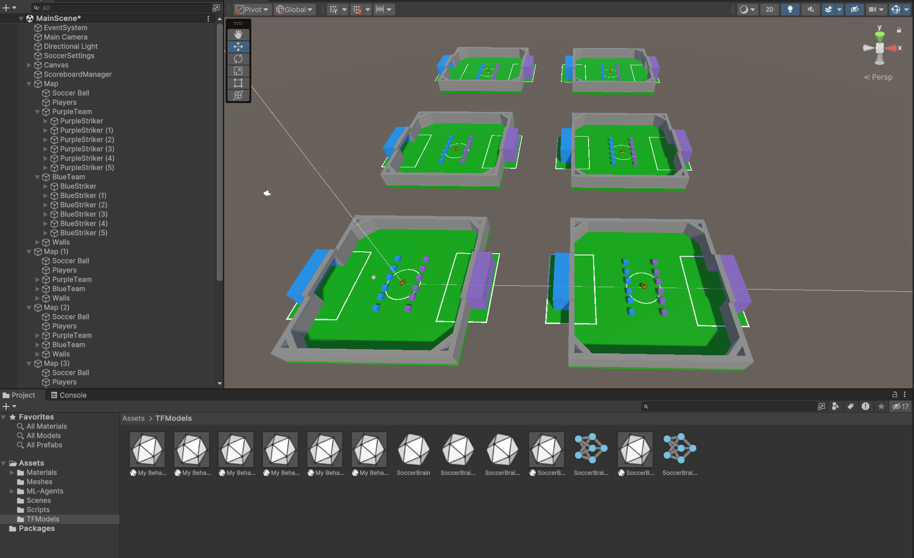

# Unity Soccer Environment with Cooperative Multi-Agent Learning



## Overview

Welcome to the Unity Soccer Environment, a cutting-edge project that utilizes cooperative multi-agent reinforcement learning (MARL) to train intelligent agents to play soccer effectively as a team. This repository contains the codebase and documentation for this exciting project.

## Table of Contents

- [Introduction](#introduction)
- [Learning Process](#learning-process)
- [Understanding Machine Learning](#understanding-machine-learning)
- [The Chosen ML Method: Proximal Optimization for Cooperative Agents (POCA)](#the-chosen-ml-method-proximal-optimization-for-cooperative-agents-poca)
- [Comparison with Other Options](#comparison-with-other-options)
- [Getting Started](#getting-started)

## Introduction

The Unity Soccer Environment is a state-of-the-art platform designed to teach agents the art of teamwork and strategy in soccer. This project explores the fascinating world of machine learning, allowing agents to learn and adapt their gameplay in a dynamic and competitive soccer environment.

## Learning Process

Our project's learning process revolves around enabling agents to:

1. **Initialize:** Agents are equipped with team affiliations (blue or purple), positions (striker, goalie, generic), and initial positions.

2. **Act and Decide:** Agents take discrete actions, such as moving, rotating, and kicking the ball, while making decisions based on their observations and the game state.

3. **Rewards and Penalties:** Agents receive rewards or penalties for their actions, enhancing their learning process. Goalies receive existential bonuses, while strikers face existential penalties.

4. **Learn through Interaction:** Agents learn by actively engaging with the environment and receiving feedback in the form of rewards or penalties.

5. **Train and Reset:** Agents go through training episodes and adapt to new scenarios as the environment resets periodically.

## Understanding Machine Learning

In this environment, machine learning, particularly reinforcement learning (RL), plays a pivotal role. Key components of RL include:

- **State Space:** Representation of the environment's current state.
- **Action Space:** The available actions for agents.
- **Policy:** The learned mapping from states to actions.
- **Rewards:** Feedback guiding the learning process.
- **Exploration vs. Exploitation:** Balancing the exploration of new actions and the exploitation of known rewarding actions.

## The Chosen ML Method: Proximal Optimization for Cooperative Agents (POCA)

Our selected ML method is Proximal Optimization for Cooperative Agents (POCA). POCA is a specialized algorithm designed for cooperative multi-agent environments. It excels in scenarios where agents must collaborate and coordinate actions to achieve common objectives.

## Comparison with Other Options

Compared to single-agent RL algorithms like Proximal Policy Optimization (PPO), POCA offers distinct advantages in multi-agent settings:

- **Cooperation:** POCA is explicitly designed for cooperative multi-agent environments.
- **Coordination:** It enables agents to coordinate their actions effectively for collective optimization.
- **Multi-Agent Training:** POCA is tailored to address challenges specific to multi-agent training, where agents' actions affect both each other and the environment.

## Getting Started

To start exploring and contributing to the Unity Soccer Environment, follow these steps:

1. **Clone this repository:**
   ```sh
   git clone https://github.com/your-username/unity-soccer-environment.git
   cd unity-soccer-environment
Set up your Unity environment:

Install Unity if you haven't already.
install Ml Agent in your Unity editor.
Open the project in Unity.
Run the project:

Start training agents in the soccer environment.
Experiment with different configurations and training scenarios.
Contribute:

Feel free to contribute to the project by creating pull requests, reporting issues, or enhancing the documentation.
Contributing
We welcome contributions from the community to improve and extend the Unity Soccer Environment. Please read our Contribution Guidelines for details on how to get involved.

License
This project is licensed under the MIT License.

Feel free to reach out if you have any questions or suggestions. Enjoy exploring the world of cooperative multi-agent learning in Unity's Soccer Environment!
